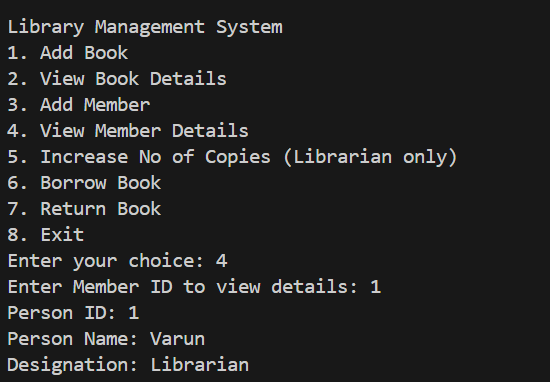

# Library Management System

## Introduction

The Library Management System is a console-based Java application designed to manage the basic operations of a library. This system allows users to add books, view book details, add members, view member details, and perform librarian-only operations such as increasing the number of book copies. Additionally, the system includes functionality for members to borrow and return books, dynamically updating the library’s inventory.

## Description

The Library Management System is built using Object-Oriented Programming principles such as Encapsulation, Inheritance, and Polymorphism. The core entities include `Book`, `Member`, and `Librarian`. Here’s what each component of the system does:

1. **Add Book**: Librarians can add new books to the library's collection by entering details such as Book ID, Title, Author, Cost, and the Number of Copies.

2. **View Book Details**: Anyone can view the details of a specific book by entering its Book ID. The system displays the book's title, author, cost, and available copies.

3. **Add Member**: Members can be registered by providing their ID, name, and designation. This information is stored in the system for later retrieval.

4. **View Member Details**: Librarians can view a member's details by entering their Member ID. This includes the member’s name and designation.

5. **Increase No of Copies (Librarian only)**: Only librarians, upon entering the correct password, can increase the number of copies for a specific book.

6. **Borrow Book**: Members can borrow a book, and the system will decrease the available copies by one. If no copies are available, the system will notify the user.

7. **Return Book**: When a member returns a book, the system increases the available copies by one, updating the inventory.

8. **Exit**: This option allows users to safely exit the system.

### Example Output Screenshots

1. **Main Menu**: The user is presented with the main menu, listing all available operations.

   

2. **Add Book**: Example of adding a book, where the user enters all necessary details.

   

3. **View Book Details**: Example of viewing book details by entering the Book ID.

   

4. **Add Member**: Example of adding a new member.

   

5. **View Member Details**: Example of viewing member details by entering the Member ID.

   

6. **Increase No of Copies**: Librarian increases the number of available copies for a specific book.

   

7. **Borrow Book**: A member borrows a book, decreasing its available copies.

   

8. **Return Book**: A member returns a book, increasing its available copies.

   

## Conclusion

This Library Management System provides a simple yet effective way to manage a library's book inventory and member records. The use of Object-Oriented Programming principles makes the system robust, easy to extend, and maintainable. Whether you're a librarian managing book inventory or a member borrowing a book, this system covers the essential functionalities needed for efficient library operations.
